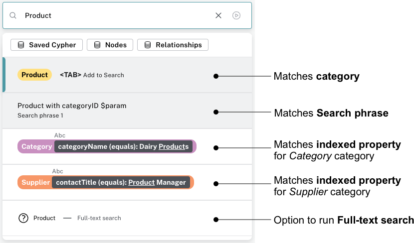
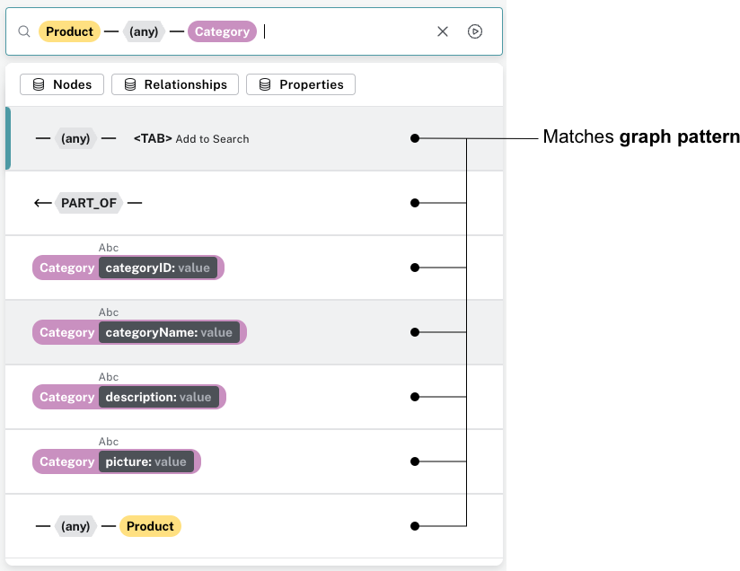
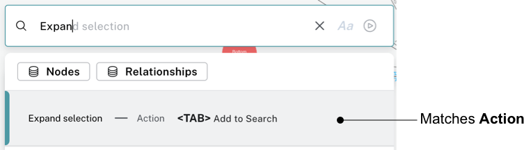
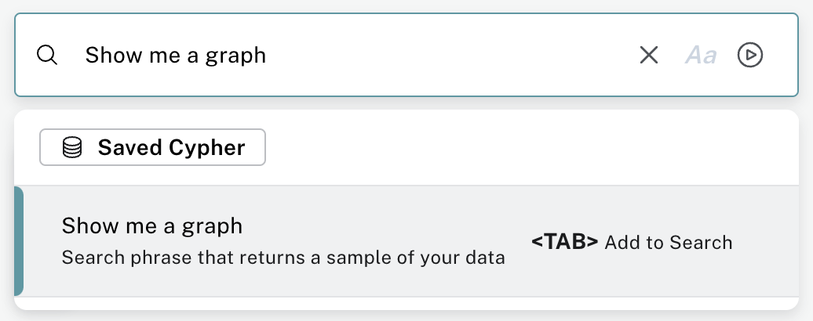

:description: This section describes the search bar in Neo4j Bloom.

[[search-bar]]
= Search bar

Bloom is a search-first environment for you to explore your graph.
To provide this experience, the search bar supports several types of search input.
When you enter a term or phrase in the search bar, Bloom provides a list of suggestions for queries you can run, based on matches in the following input types:

* Search phrase
* Graph pattern
* Full-text search
* Actions

[.shadow]

[.shadow]

[.shadow]

[TIP]
====
You can press <TAB> or click on a suggestion in the list to select it, or scroll to the suggestion and press ENTER to run it.
====

== Sample Search phrase

When Bloom autogenerates a Perspective (see xref::/bloom-perspectives/perspective-creation.adoc[Creating a Perspective] for more information) or when you create your own (non-empty) Perspective, Bloom provides a sample Search phrase to help you see the data in your graph.
The Search phrase is called _Show me a graph_ and is available in the search bar.
It returns a sample of your data.

[.shadow]

== Graph pattern

Graph patterns are a relaxed, near-natural language grammar based on a vocabulary drawn from node labels, relationship types and property keys and indexed property values, enriched by categories or other configuration as defined in the applied Perspective (see xref::/bloom-perspectives/bloom-perspectives.adoc[Perspectives] for more detail).
Terms that Bloom detects are used to create potential pattern matches, are added to the suggestions list, from which you can pick the one you wish to query.
See xref::/bloom-tutorial/graph-pattern-search.adoc[Graph pattern search] for tips on graph pattern searching.

[[search-phrase]]
== Search phrase

A Search phrase is essentially an alias for a pre-defined graph query, which is saved within a Perspective.
Search phrases allow for user-friendly access to queries that need to be run frequently, or can’t be conveniently expressed as a search pattern.
Search phrases also allow for highly customized domain-specific questions to be asked, and can:

* be paired with a parameterized Cypher query.
* call algorithms, or anything else that can be called using procedures.
* modify the graph (requires write access).

See xref::/bloom-tutorial/search-phrases-advanced.adoc[Search phrases for advanced queries] tutorial topic for tips on using Search phrases.

== Full-text search

When Bloom can’t find an appropriate suggestion for the entered search term, you have the ability to run a full-text search against the Neo4j database.
Bloom uses the native full-text indexes in the database for this feature. You will need to set up a full-text index to enable full-text search in Bloom.
Without any full-text index configured, Bloom will fall back to searching in all available indexed string properties.

See xref::/bloom-tutorial/full-text-search.adoc[Full-text search] tutorial topic for tips on using the full-text search option.

== Actions

Actions are phrases that trigger user-interface commands when typed in the search bar, e.g. `Clear Scene` will empty the canvas of the currently shown nodes and relationships.
This lists some of the available Actions:

* Invert selection - selects every unselected node and deselects any selected node/s.
* Fit to selection - zooms in on the selection and centers it on the canvas.
* Expand selection - option to see everything directly connected to the selected node/s.
* Clear Scene - empty the canvas.
* Dismiss - removes everything selected.
* Dismiss others - removes everything not selected.
* Refresh Data - refreshes the data on the canvas.
* Redo - repeat the latest action.
* Undo - undo the latest action.

See xref::/bloom-appendix/bloom-appendix.adoc#default-actions.adoc[Default actions and shortcuts] for the complete list and associated keyboard shortcuts.

